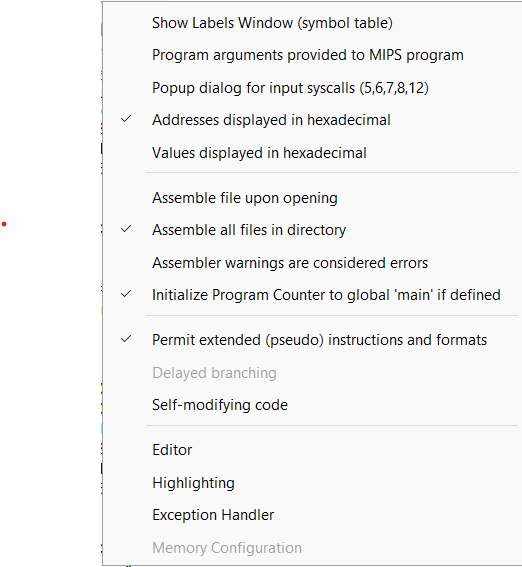

# Computer_Arch_Final_Project

# MARSPlus Setup Guide

This repository uses **MARSPlus**, an extended version of the MARS MIPS simulator.

---

## 📦 Installation

1. Download **MARSPlus** from the official source:  
   [MARSPlus GitHub](https://github.com/JavaMIPSEngine/MARSPlus).

2. Extract the contents into a folder of your choice.

3. Open the MARSPlus `.jar` file to launch the simulator.

---

## 🖼️ Screenshot

Please have the following settings selected


---

## ▶️ Build & Run

1. Open the `main.asm` file in **MARSPlus**.
2. Assemble the program by clicking **Assemble (F3)**.
3. Run the program by clicking **Go (F5)**.
4. Maximize the output screen by pressing the ^ arrow
5. Enjoy!

---

## ✅ Notes
- Make sure you have **Java installed** (Java 8+ recommended).
- If double-clicking the `.jar` doesn’t work, run it from the terminal:
  ```bash
  java -jar MarsPlus.jar
